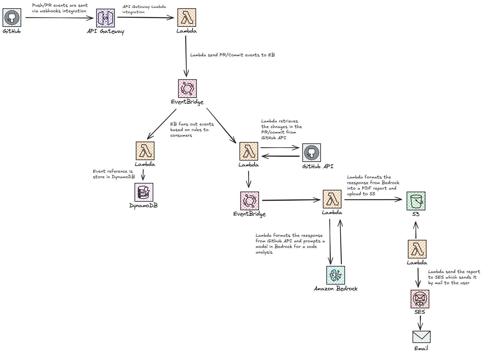

# Vortex AI: Automated Code Review and Analysis Platform

Vortex AI is a serverless application that provides automated code review and analysis for GitHub repositories. It leverages AWS services and AI capabilities to analyze pull requests and commits, providing detailed feedback on code quality, potential bugs, and security issues in real-time.

The platform integrates directly with GitHub through webhooks, processing pull requests and commit events to provide intelligent code analysis. Using AWS Bedrock's Claude model, it performs deep analysis of code changes and provides actionable feedback to developers. The system maintains a comprehensive history of all analyzed changes in DynamoDB for future reference and analysis.

## Repository Structure

```
.
├── infrastructure-cdk/          # AWS CDK infrastructure code
│   ├── bin/                    # CDK app entry point
│   ├── lambda/                 # Lambda function implementations
│   │   ├── analyzeDiff.ts      # AI-powered code analysis
│   │   ├── fetchDiffedChanges.ts # GitHub diff retrieval
│   │   ├── index.ts           # Webhook handler
│   │   └── recordGithubEventDetails.ts # Event recording
│   └── lib/                    # CDK construct libraries
│       ├── constructs/         # Reusable CDK constructs
│       └── stacks/            # Infrastructure stack definitions
└── vortex-frontend/           # Next.js frontend application
    └── src/                   # Frontend source code
```

## Usage Instructions

### Prerequisites

- Node.js v20 or later
- AWS CLI configured with appropriate credentials
- GitHub repository with webhook access
- AWS account with permissions to create:
  - Lambda functions
  - API Gateway
  - DynamoDB tables
  - EventBridge
  - IAM roles
  - Bedrock access

### Installation

1. Clone the repository:

```bash
git clone https://github.com/your-org/vortex-ai.git
cd vortex-ai
```

2. Install dependencies:

```bash
# Install infrastructure dependencies
cd infrastructure-cdk
npm install

# Install frontend dependencies
cd ../vortex-frontend
npm install
```

3. Deploy the infrastructure:

```bash
cd infrastructure-cdk
npx cdk deploy --all
```

### Quick Start

1. Configure GitHub webhook:

   - Go to your GitHub repository settings
   - Add new webhook
   - Use the API Gateway URL output from the CDK deployment
   - Select events: Pull requests and Pushes
   - Set content type to application/json

2. Create a secret in AWS Secrets Manager:

```bash
aws secretsmanager create-secret \
  --name vortex/github-app-webhook-secret \
  --secret-string "{\"vortex-github-app-webhook-secret\":\"your-webhook-secret\"}"
```

3. Test the integration:
   - Create a new pull request or push commits
   - Check AWS CloudWatch logs for analysis results

### More Detailed Examples

1. Pull Request Analysis:

```typescript
// Create a pull request to trigger analysis
// The system will:
await analyzePullRequest({
  prId: 123,
  repo: "org/repo",
  files: [
    {
      filename: "src/app.ts",
      additions: 10,
      deletions: 5,
      changes: 15,
    },
  ],
});
```

2. Commit Analysis:

```typescript
// Push commits to trigger analysis
// The system will:
await analyzeCommit({
  commitId: "abc123",
  repo: "org/repo",
  files: [
    {
      filename: "src/utils.ts",
      changes: 20,
    },
  ],
});
```

### Troubleshooting

1. Webhook Not Triggering

- Check API Gateway logs in CloudWatch
- Verify webhook secret in Secrets Manager
- Ensure GitHub events are configured correctly

2. Analysis Not Working

- Check Lambda function logs in CloudWatch
- Verify Bedrock permissions
- Ensure EVENT_BUS_NAME environment variable is set

3. DynamoDB Issues

- Verify table exists and has correct permissions
- Check Lambda execution role permissions
- Monitor table capacity units

## Data Flow

The system processes GitHub events through a series of Lambda functions that analyze and store code changes using AWS services.

```ascii
GitHub Event → API Gateway → Webhook Handler → EventBridge → Analysis Pipeline
     ↓                                            ↓              ↓
  Webhook                                    DynamoDB       Bedrock AI
```

Component Interactions:

1. GitHub sends webhook events to API Gateway endpoint
2. Webhook handler validates and processes events
3. Events are published to EventBridge for routing
4. fetchDiffedChanges retrieves code changes from GitHub
5. analyzeDiff performs AI analysis using Bedrock
6. Results are stored in DynamoDB for reference
7. Event details are recorded for auditing

## Infrastructure



### Lambda Functions

- `WebhookHandler`: Processes GitHub webhook events (Node.js 22.x)
- `AnalyzeDiff`: Performs code analysis using Bedrock
- `FetchDiffedChanges`: Retrieves code changes from GitHub
- `RecordGithubEventDetails`: Stores event data in DynamoDB

### API Gateway

- HTTP API endpoint for webhook integration
- POST /webhook route

### DynamoDB

- Table for storing PR and commit analysis results
- Partition key: PK (string)
- Sort key: SK (string)

### EventBridge

- Custom event bus for routing internal events
- Rules for processing PR and commit events

### IAM

- GitHubOidcRole for GitHub Actions deployment
- Lambda execution roles with least privilege

## Deployment

1. Prerequisites:

- AWS CDK CLI installed
- GitHub repository access
- AWS credentials configured

2. Deploy infrastructure:

```bash
cd infrastructure-cdk
npm run build
cdk deploy --all
```

3. Configure GitHub:

- Add webhook URL from CDK output
- Configure webhook secret
- Set up GitHub Actions deployment

4. Monitor deployment:

- Check CloudWatch logs
- Verify API Gateway endpoint
- Test webhook integration
